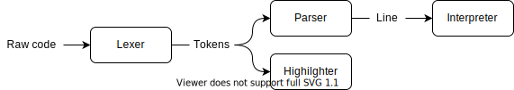

# Tiny Mathematical Language

This project is a small experimentation with a mathematical language.

**WORK IN PROGRESS**

## Organisation

- [tml](./tml) The language implementation written in rust
- [repl](./repl) A TUI repl written in rust
- [wasm](./wasm) A wasm binding for integration with the web
- [website](./website) The project website and code editor written in svelte

## Language implementation

### Lexer

The role of the lexer is to find tokens in raw code. A token is a slice of UTF-8
characters associated with a kind (operator, number, etc.). The lexer is pull
designed making it allocation free.

### Highlighter

The role of the highlighter is to generate styled HTML from tokens.

### Parser

The role of the parser is to interpret tokens as a line. There is three types of
lines :

- _Expression_ when the line is interpretable
- _Comment_ when the line should be ignored
- _Empty_ when the line is empty

There is two type of expression based on what is returned :

- _Literal_ when a number is generated
- _Assign_ when a number is stored
- _Print_ when a string is generated

### Interpreter

The role of the interpreter is to perform operations encoded in expression.

## Online Code Editor

### Current implementation

The core of the code editor is a very small library (<2kb) which provide basic
machinery for copy/paste, undo/redo and highlighting. On top of that I linked
the language implementation (interpretation & highlighting) using a WASM
library, and I added hand-made line numbers and an interpretation result view
which is scroll synchronized with the code editor. This simple design is working
really well for the scale of this project.

### First version postmortem

The DOM has been developed to present online documents and have some difficulty
to scale with requirements of web application. I you want optimal performance
you must rely on the DOM the less possible. For a code editor, this mean
implementing a virtual list and virtual scrollers. The existing code editor
libraries are very powerful, but they were also too bloated for my project. This
is reason why I decided to try to write my own code editor from scratch, using
the reactive design of Svelte.

As you can imagine, this was way too ambitious ; writing a code editor is a
whole project not a part of a small one. I managed to have something basic
working with many hours of work and research, but the result was still lacking
usability and was very buggy. Trying to leverage Svelte reactivity was a big
mistake as I needed total control of the ordering between cursor mouvement,
scroll focus and visible lines refresh. I think a saner design for a real code
editor would be to use WebGL and rust to reach optimal performance and control.
